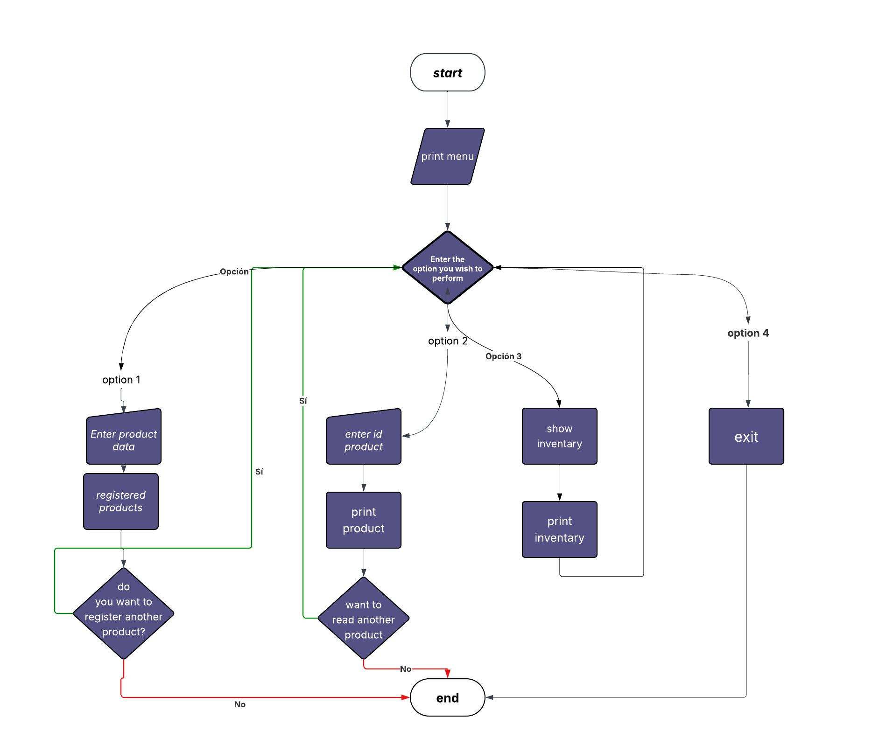

# 🥑 RIWIMART RETAIL CHAIN

Este es un sistema sencillo de **Gestión de Inventario** desarrollado en Python. Permite a los usuarios administrar productos de una cadena de retail de forma interactiva a través de la terminal.

## 🚀 Funcionalidades

El sistema ofrece las siguientes opciones:
1.  **Añadir Producto:** Permite ingresar el nombre, precio unitario y cantidad de un nuevo artículo.
2.  **Mostrar Inventario:** Despliega una lista detallada de todos los productos registrados.
3.  **Calcular Estadísticas:** Genera un reporte del valor total del inventario, unidades totales en stock y variedad de productos.
4.  **Salir:** Finaliza la ejecución del programa.

## 🛠️ Tecnologías utilizadas

*   **Lenguaje:** Python 3.x
*   **Estructuras de datos:** Listas y Diccionarios.

## 📦 Instalación y Uso

1. **Clonar el repositorio:**
   ```bash
   git clone <url-de-tu-repositorio>

()
